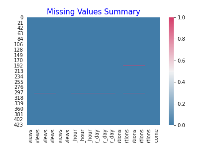
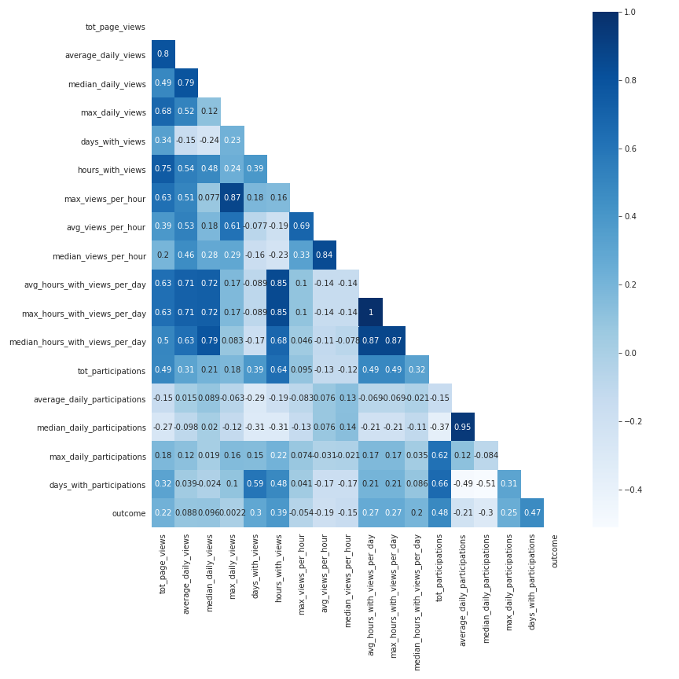
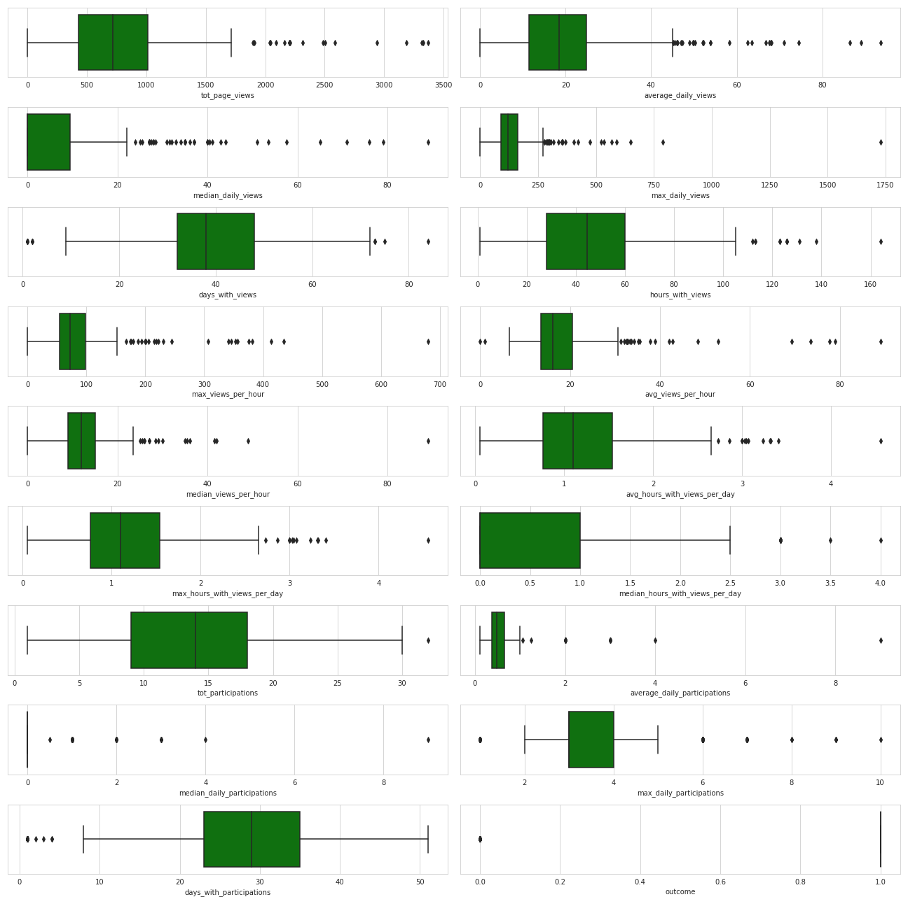

# Predicting student's failure to meet passing criteria in online Artificial Intelligence course
This project aims at predicting the outcome of a student in an online course. The course is run by a popular North American University, and it uses Canvas as the Learning Management System (LMS). The course has a duration of 9 weeks from start to finish, we aim at predicting if a student will complete the course after collecting the first 4 weeks of student activity data. This is relevant because if we can obtain early warning that some students are not on track to complete, the learning facilitators can reach out to the student to provide help, allow for extra time to complete the deliverables, or offer to shift the enrollment to a later cohort. 

## Data

The data for this project is real data from 5 cohorts of students in the same 9-week online program. The data is anonymous, individual students are identified by the `student_id` number. This id is meaningless to other students or the general public. To access the data we make use of the Canvas LMS API. Please note, while every user can make API calls with their individual API key, a student account will not grant you access to download course level data. You will need to have TA, Instructor, Observer, or Admin privileges, to execute most of these API calls. 

### Outcome Variable
Before any other data extraction effort, we had to identify the outcome variable. This would indicate, whether the student passed `1` or failed `0` the course. In order to obtain this, we submit a GET request to `/api/v1/courses/{COURSE_ID}/students/submissions?student_ids[]={STUDENT_ID}&per_page=200`.
This returns the submissions for the relative student in the course. Out of all the submissions, only the Assignments and the Capstone project count towards the final grade. Counting the number of assignments submitted and graded complete, and comparing it to the passing criteria of 9 out of 11 Assignments + 1 Capstone, we can create the binary outcome variable.

### Feature Engineering
While there are many possible data sources, not many contain a timestamp that we can use to pretend we are halfway in the course. For example, the same endpoint used for the Outcome variable has information about the submission completion and tardiness, which would be related to the student outcome. however this data represents summary data at the end of the course (because the course has already taken place). For future courses, we can imagine collecting this student summary daily to generate a timeline of the event.
The endpoint which does have a timestamp and that we use for our initial models is `/api/v1/courses/{COURSE_ID}/analytics/users/{STUDENT_ID}/activity?per_page=200`
The data pulled with this request contains essentially a count of how many pages have been viewed by the student in any given hour, and the number of submissions for each day. From these two data series, we extract and calculate the major statistical quantities that could be used to augment the prediction.

The list of features is:
```
'student_id'
'course_id'
'tot_page_views'
'average_daily_views'
'median_daily_views'
'max_daily_views'
'days_with_views'
'hours_with_views'
'max_views_per_hour'
'avg_views_per_hour'
'median_views_per_hour'
'avg_hours_with_views_per_day'
'max_hours_with_views_per_day'
'median_hours_with_views_per_day'
'tot_participations'
'average_daily_participations' 
'median_daily_participations'
'max_daily_participation'
'days_with_participations'
```

## Exploratory Data Analysis

Given the nature of the data, it is understandable that there are not many missing values. So even though the overall amount of data is small (less than 500 records), we decide to discard the 3 records with missing values.
```
<class 'pandas.core.frame.DataFrame'>
Int64Index: 422 entries, 0 to 424
Data columns (total 18 columns):
 #   Column                           Non-Null Count  Dtype  
---  ------                           --------------  -----  
 0   tot_page_views                   422 non-null    int64  
 1   average_daily_views              419 non-null    float64
 2   median_daily_views               419 non-null    float64
 3   max_daily_views                  419 non-null    float64
 4   days_with_views                  422 non-null    int64  
 5   hours_with_views                 422 non-null    int64  
 6   max_views_per_hour               419 non-null    float64
 7   avg_views_per_hour               419 non-null    float64
 8   median_views_per_hour            419 non-null    float64
 9   avg_hours_with_views_per_day     419 non-null    float64
 10  max_hours_with_views_per_day     419 non-null    float64
 11  median_hours_with_views_per_day  419 non-null    float64
 12  tot_participations               422 non-null    int64  
 13  average_daily_participations     417 non-null    float64
 14  median_daily_participations      417 non-null    float64
 15  max_daily_participations         417 non-null    float64
 16  days_with_participations         422 non-null    int64  
 17  outcome                          422 non-null    int64  
dtypes: float64(12), int64(6)
memory usage: 62.6 KB
```




When looking at the pairwise Pearson correlation coefficients for the input variables we observe that several features have a very high correlation. This is a result of our feature engineering effort. From two time-series of data, `page_views` and `participations`, we have calculated over a dozen variables, with simple permutation or by calculating fundamental statistical properties.



Instead of discarding variables based on their correlation coefficient, we will perform feature selection with Lasso regularization and by training a naive RandomForest model and extracting the feature importance recursively.

Looking at the distribution of the data we can see that there is a large number of outliers, however, since we know how this data was generated and collected, we can confidently say that these are not artifacts but rather extreme values in the student population. 

For example, the student with `max_daily_views ~ 1750`, could simply be someone who had accumulated a lot of work and dedicated a full day to catch up on the course. 
Similarly, the student with an `avg_daily_prtecipation ~ 9` may seem unreasonable since there is a maximum of ~40 participations that a student can make in the course. However, this would simply suggest that the student in question concentrated all the work in a handful of days like in the case above. Please note that the `avg_daily_participation` is calculated as `np.max(df2[:cutoff_date].resample('D').count())[0]`, therefore it is the average daily participation on the days of activity for the respective student.



By looking at the distribution of the data across the two classes we can observe some significant differences between the populations (student that passed and students that failed the course), while it's not sufficient to look at these graphs and conclude on the statistical significance of a difference in the distribution, it's a signal that there are some nuances in the data that the algorithm of choice could be trained to distinguish and use as the basis for the prediction.


Finally, we observe that there is an imbalance in the outcome variable in favor of the students who completed the course. This is not surprising, however, we consider ~25% for the minority class to be sufficient to avoid needed to balance the dataset at least in the first iteration of this modeling attempt. 


## Feature Selection

To narrow down the list of predictor variables we adopt two techniques and compare their results: Lasso Regularization, and Recursive Feature Elimination with a Random Forest Classifier.
Given the nature of the problem at hand, we use precision as the metric of choice to compare the models. This will allow us to select the models with the lowest false positives rate. The purpose of this prediction is to identify the students with the highest likelihood of failing the course so that they can be contacted midway through the course and provided with more guidance and assistance so that they can complete the course successfully. 

After performing *Lasso regularization* the features with non-zero coefficients are:
```
- hours_with_views
- avg_views_per_hour
- tot_participations
- days_with_participations
```
Then we calculated the cross-validated score of a Random Forest Classifier using only these 4 features. This model had a mean precision of 0.854. 

The next technique we used is Recursive Feature Elimination, which generally confirms the results obtained by the Lasso approach. 


```
- days_with_views
- hours_with_views
- tot_participations
- days_with_participations
```

When comparing the performance of the two models two feature sets with the baseline of using all the features, we observe that the variables selected with Lasso yield a higher score and lower variance, thus we will use the following 4 features: 
er performing *Lasso regularization* the features with non-zero coefficients are:
```
- hours_with_views
- avg_views_per_hour
- tot_participations
- days_with_participations
```


## Modeling

Given the nature of the data and the type of classification problem, we focus the modeling efforts on tree-based models. We compared the Scikit-Learn implementation of the Random Forest for the Bagging ensembling technique, and the XGBoost for the Gradient Descent Boosting approach.

In both cases, we use Bayesian Optimization with cross-validation to find the best performing hyper-parameters while limiting overfitting. To compare the performance of the two models we calculate the Area Under the Receiving Operating Characteristic curve. 


As we can see the Random Forest captures a slightly larger area under the ROC curve.

Furthermore, when comparing the confusion matrix of the XGBoost


with that of Random Forest classifier


We observe that the False Positives for the Fail class are slightly lower in the Random Forest model. 


## Conclusion

Based on these findings we conclude that the optimal model for this prediction problem is a Random Forest Classifier with the following parameters:
```
Filename : ../models/RandomForestClassifier__precision.pkl
Model type : <class 'sklearn.ensemble._forest.RandomForestClassifier'>
Model Parameters : OrderedDict([('class_weight', 'balanced'), ('max_depth', 3), ('min_samples_leaf', 4), ('min_samples_split', 4), ('n_estimators', 316)])
CV Score : 0.9047453703703704
Test Score: 0.8352941176470589
```
And using the following 4 features to inform the prediction:
```
- hours_with_views
- avg_views_per_hour
- tot_participations
- days_with_participations
```